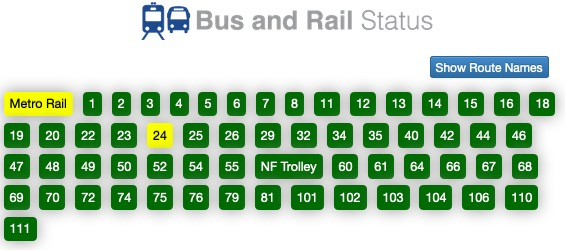
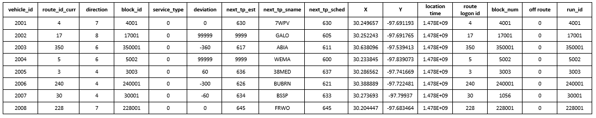

## All Routes of NFTA

## Goal

### First Stage
From the collected data during **one single day** (e.g., `data/20200730.csv`), get the traffic speed (or travel time) on each road segment during each time interval, and save it into a file named `data/20200730_road.csv`. If there is no data for certain road segment during certain time interval, leave it empty. On the other hand, if there are more than one values (e.g., two or more buses traveled on the same road segment during the same time interval), then use the average.

This table shows an example of the result for one day with time interval set to be 5 minutes.

In this project, we call this matrix "speed matrix"

| Road\Time   | 00:00 - 00:04 | 00:05 - 00:09  | 00:10 - 00:14 | ... | 23:55 - 23:59 |
| :---:       |    :----:   |     :---: | :---: | :---: | :---: |
| Road 1      |         | 30.5       |        | ... |
| Road 2      | 50.0      |        |    20.8   | ... | 40.3
| Road 3      |         |   40.7     |       | ... |
| ...         | ...        | ...         | ...    | ... | ...
| Road N      |    20.0     |   30.6     |     | ... | 40.5

### Final Goal

Infer the missing data using data imputation methods based on all historical data.

## Data format

The format of the data file is as follows,

### columns:

    'vehicle_id'
    'route_id_curr': the route number,
    'direction': possible values 0, 19, and 20, where 19 may denote inbound, and 20 for outbound.
    'block_id'
    'service_type'
    'deviation'
    'next_tp_est':
    'next_tp_sname':
    'next_tp_sched':
    'X': latitude
    'Y': longitude
    'location time':
    'route logon id'
    'block_num'
    'off route'
    'run_id'

## Process data

- [ ] Preprocess
  - [x] Single file
    - [x] Remove the last comma
    - [x] Remove the rows that have `8000 <= vehicle_id < 9000`
      - These are vehicles for para-transit, belongs to NFTA PAL service.
    - [x] Remove the rows that have `route_id_curr == 0` and `route_id_curr == 17`
      - These are likely special placeholder for vehicles moving around or running special route.
    - [x] Remove the rows that have `route_id_curr > 111`
      - As of Feb 4, 2021 the largest route number is 111
  - [x] Merge the files under each folder (daily) into one single file, i.e., `yyyyMMdd.csv`
    - [x] The columns that are useful and kept are: `vehicle_id`, `route_id_curr`,`direction`, `block_id`, `next_tp_est`, `next_tp_sname`, `next_tp_sched`, `X`, `Y`, `location time`, and the added columm `datatime` which is used for better readability.
    - [x] Sort the data based on `vehicle_id`, `route_id_curr`, `direction`, and `location time`.
- [x] Get the travel time/speed on each road segment from the GPS data
  - [x] Get all road segments (usually between road intersections) that are traveled by at least one bus route. The bus routes can be found [here](https://metro.nfta.com/). Road segments are directional.
    - [x] Each road segments should be marked/denoted by a series of geographical points
    - [x] Save road segments with information into files, e.g., `road segment ID`, `road intersection 1 ID`, `road intersection 2 ID`.
      - [x] We need to mark/record/store road intersections first, e.g., `road intersection ID`, `latitude`, `longitude`
    - [ ] Create files to store the route information, including lists of `road segments ID`s in **inbound** and **outbound** directions. `json` should be a good choice.
      - One file to contain all routes, or one seperate file for each route
    - [ ] Show the road segments and intersections on Maps, e.g., my google maps.
  - [ ] Map raw GPS data onto corresponding road segments
    - [ ] Make use of the fact that if a GPS point comes from a certain bus route, then it can only been mapped onto one road segment that belongs to that route.
    - [ ] Due to low sampling rate, there might be less than two points on certain road segment. Need to use interpolation and other ways to solve
  - [ ] Save the results so that
    - [ ] They can be easily loaded/used by other programs
    - [ ] They can be easily updated when there are new data coming in

The bus might stop at some location for a long period

## Usage

### To run it manually

1. To start it, you need to put the GPS data in `data/yyyyMMdd/raw`. Example: `data/20200731/raw`.
2. Run `process_data.py`. This file will process all the folder in `data` that is larger than `min_file_size`. By 
   default, it is 10 byte. 
   - `python3 process_data.py`
3. Run `reformat_data.py` to reformat the data that processed by previous step. This will create `data/yyyyMMdd/sorted` 
   and `data/yyyyMMdd/unsort`
   - `python3 process_data.py 20200731`
4. Run `osm_interperter.py` to convert OSM data to the format that this project is using. The file will be store in 
   `graph/`
   - `python3 osm_interperter.py map/Buffalo_NFTA_BetterFit.osm.pbf`
5. Run `find_traffic_speed.py` to generate the table mention [here](#first-stage)
   - `python3 find_traffic_speed.py 20200731`

## Implementation Details by files

### osm_interpreter

The used OSM data file (stored under folder `map/`) can be downloaded from [bbbike](https://extract.bbbike.org/). 

>The most update version of the map that we use can be found here.
> 
>[Buffalo_NFTA_GoodFit.osm.pbf](https://extract.bbbike.org?sw_lng=-79.35&sw_lat=42.417&ne_lng=-78.338&ne_lat=43.414&format=osm.pbf&coords=-79.35%2C42.511%7C-78.349%2C42.417%7C-78.338%2C43.414%7C-79.053%2C43.348%7C-79.083%2C43.082%7C-78.924%2C42.915&city=Buffalo_NFTA_GoodFit)
> 
>[Buffalo_NFTA_BetterFit.osm.pbf](https://extract.bbbike.org?sw_lng=-79.158&sw_lat=42.564&ne_lng=-78.448&ne_lat=43.213&format=osm.pbf&coords=-79.158%2C42.564%7C-79.056%2C42.57%7C-78.895%2C42.682%7C-78.756%2C42.661%7C-78.547%2C42.699%7C-78.448%2C42.904%7C-78.66%2C42.942%7C-78.659%2C43.213%7C-79.084%2C43.19%7C-79.083%2C43.067%7C-79.007%2C42.953%7C-78.923%2C42.92&city=Buffalo_NFTA_BetterFit)

This file has the code to convert an osm file downloaded from openstreetmap and find all the NFTA routes and save their
information in a dictionary. For debugging purposes, the NFTA roads that are found are also plotted. Using pickle or 
JSON, 3 dictionaries and 1 list are saved in `graph/`

- final_node_table

  - final_node_table was a dictionary that stored the node id and the latitude/longitude coordinates as a key value 
    pair.

- final_way_table

  - final_way_table was a dictionary that stored the way id and a list of node id's as a key value pair.

- final_relation_table

  - final_relation_table was a dictionary that stored the relation id and a tuple that had a list of nodes and ways and 
    a list of tags. The list of nodes and ways were the stops and streets that made up a specific NFTA route. Nodes are 
    usually included because the routes start and end at points that are generally not the natural endpoint of a road. 
    The tags are useful because they possess information on the route like its name and what type of vehicle traverse 
    the route (e.g. bus).

- relations

  - relations is a list that contains the same information as final_relation_table, albeit in a less easily accessed 
    form of a list of 3-tuples.

### find_nearest_road

This python file is not necessary for the final execution of the code, but it is useful for demoing and testing the 
effectiveness of the math I'm using for finding the nearest road to a specific latitude and longitude coordinate. 
Essentially, we will find the nearest road (or ways in OSM) according to the bus's location. The way also has to be 
part of the route that the bus is currently running. If no route is match, we will try to match the bus's location 
with all route that NFTA runs and find the nearest road of the bus.

The distance between two location is computed based on the haversine formula. However, by takes advantage of the small 
scope of the area of Buffalo, we use a quadratic function to perform approximate calculations to reduce the time 
required to calculate sine and cosine in the haversine formula. In the case that two location's distance (compute by 
haversine formula) is less than 40 m (131.23 ft), the average difference 1.927 m (6.322 ft), but allow the program run 70% faster. 
The performance improvement caused by such small errors led us to choose this approximate approach.

The haversine formula approach is still accessible with function name `distance_old`

### reformat_data

It was made necessary in order to parse the data in a more convenient manner. The data is first separated by bus and 
then resorted by time, from earliest to latest. This was necessary to accurate plot the path and direction the bus 
travels in throughout the day.

### find_traffic_speed

After the `osm_interpreter.py` has been run at least once to generate the nodes, ways (roads), and relations (routes) 
of the Buffalo region and `reformat_data.py` has been run on the data we wish to parse, we can execute the code in 
`find_traffic_speed.py`.

By default, we using 5 minute intervals, there are a total of 288 intervals that must be accounted for, so the final 
result is a dictionary. The keys are the way id's. The values are lists/arrays that have a length of 288, which is the 
number of intervals if we have 5 minute intervals for a whole day. Accordingly, [0] is the 00:00 - 00:04 interval up 
to [287], which is 23:55 - 23:59.

> A new update feature allows us to use any integer that can divides 1440 as the interval. Although numbers like 1, 2, 
> 3, 4 are allow, we recomment to set the interval longer than 5 min.

We take every consecutive datapoint in the same time interval and find the road, distance, and time between the two. 
The speed we find is added to the road(s) that are involved in the calculation. After we go through every datapoint, 
we average the speeds we found for every road to get the final result.

The final result is a dictionary of road speeds with the pair (way id : average speed). This dictionary is saved using 
csv in `data/yyyyMMdd/result` and can be reloaded at any time for future calculations.

To make the results easier to read, we visualize the results on the map, right now it is on OSM. The map could
generate by interval, or could generate by multiple interval's average. For debug purposes, 
in OSM all road can be click to view more information.

###helper/

The global variable file and some helper function are in this folder. For more information about each file, please read
the comment in the file.